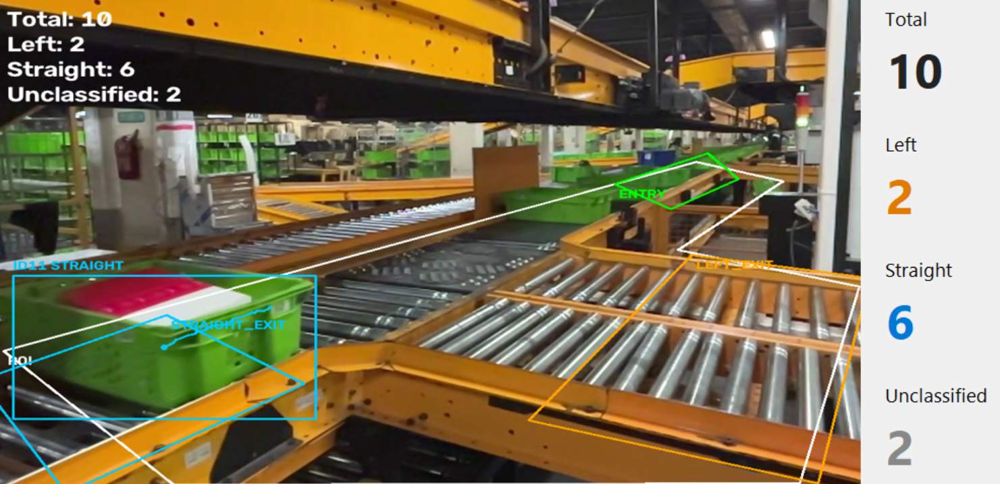
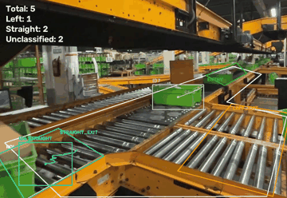
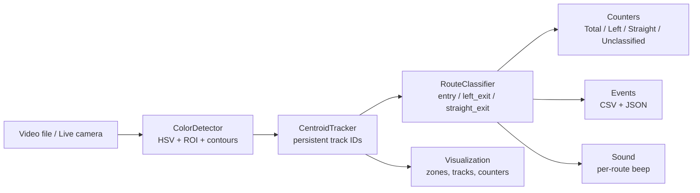

# Green Basket Sorter Vision


A computer vision pipeline that watches a warehouse roller-conveyor sorter, tracks each green tote with a persistent ID, and reports which exit lane it took, live, with counters, an annotated video, and CSV/JSON event logs.



## Demo



The bounding box, track ID, and route label follow each tote as it moves. The zone outlines and the four counters (Total, Left, Straight, Unclassified) come from `src/visualization.py`, drawn on every frame by the same pipeline that runs from the CLI, the GUI, and a live camera.

## What it does

The camera looks at a real diverging sorter: one incoming lane feeds a kicker mechanism that sends each tote down one of two downstream lanes. The pipeline:

1. Segments green totes from the frame with an HSV color mask, restricted to a hand-calibrated region of interest.
2. Tracks each detection across frames with a persistent ID, tolerant of a few missed frames (occlusion, motion blur).
3. Watches where each track's centroid goes: crossing the `entry` zone counts it once; landing in `left_exit` or `straight_exit` decides its route, once.
4. Writes an annotated video, a per-basket CSV, and a JSON summary, and can beep a distinct tone per route in real time.

A basket that disappears before reaching an exit zone (lost track, left the frame) is reported as `UNCLASSIFIED` rather than guessed.

## Why it exists

The frame also contains a second, unrelated conveyor and background shelving stacked with the same green totes, both of which would otherwise produce false detections. Getting the counts right required treating detection, tracking, and routing as separate problems: a naive per-frame color count would double-count a tote that sits near a zone boundary for several frames, and a single-frame classifier cannot tell which physical exit a tote used. The zone-crossing state machine in `route_classifier.py` exists specifically to avoid both failure modes.

## Key capabilities

| Capability | Outcome |
|---|---|
| HSV segmentation + ROI masking | Ignores background shelving and the unrelated conveyor without training a model |
| Centroid tracking with missed-frame tolerance | A tote briefly occluded keeps its ID instead of being counted twice |
| Zone-crossing state machine | Each tote is counted once and routed at most once, with an explicit `UNCLASSIFIED` fallback |
| Click-to-draw zone calibration | Zones are drawn on a real frame, not guessed from pixel coordinates |
| Shared pipeline for file, GUI, and live camera | The same detection/tracking/routing logic runs identically regardless of source |
| Per-route audio alert | Confirms a classification without watching the screen |

## Architecture



| Component | File | Responsibility |
|---|---|---|
| Detection | `src/color_detector.py` | HSV mask, ROI, contour/geometry filtering to `Detection` objects |
| Tracking | `src/tracker.py` | Greedy nearest-centroid assignment, missed-frame tolerance |
| Zones | `src/zones.py` | Polygon zones from `config.yaml`, with tolerance inflation |
| Routing | `src/route_classifier.py` | Per-track state machine: entry → sorter → exit zone |
| Counting | `src/counter.py` | Total/Left/Straight/Unclassified counters, per-basket events |
| Output | `src/events.py`, `src/visualization.py`, `src/sound.py` | CSV/JSON, overlays, audio alerts |
| Orchestration | `src/pipeline.py` | Wires the above into one `process_frame()` call, shared by `main.py` and `gui.py` |

## Quick start

```bash
pip install -r requirements.txt
python main.py --input data/input.mp4 --config config.yaml
```

This writes `outputs/annotated_output.mp4`, `outputs/events.csv`, and `outputs/summary.json`, and prints the final counts.

Optional flags:

- `--debug` — live preview window (`q` to quit).
- `--max-frames N` — process only the first N frames.

## GUI (file or live camera)

```bash
python gui.py --config config.yaml --camera-index 0
```

Or double-click `run_gui.bat` on Windows, which installs dependencies and launches the app.

- Video is shown on the left; Total / Left / Straight / Unclassified update live on the right.
- **Browse... + RUN** processes a chosen video file.
- **LIVE** runs the same pipeline from a camera (prompts for built-in webcam or USB camera).
- **STOP** ends the run and writes `events.csv` / `summary.json`, whether the source was a file or a camera.
- **Calibrate Zones** opens the click-to-draw editor against the current file or a chosen camera and saves into `config.yaml`.
- **Show Zones** overlays the ROI/entry/exit polygons on the video; off by default so the normal view stays uncluttered.
- **Show Color Mask** displays the raw HSV segmentation mask instead of the annotated video, useful when tuning `hsv.lower`/`hsv.upper`.

## Calibration

Zone polygons are specific to this camera's framing and are not meant to be guessed by hand. Draw them on a real frame instead:

```bash
python tools/zone_editor.py --input data/input.mp4 --frame 500
```

| Key | Action |
|---|---|
| left click | add a point to the current zone |
| `n` | finish the current zone (3+ points) and move to the next |
| `z` | undo the last point |
| `r` | restart the current zone |
| `f` / `b` | step forward/back 30 frames (file sources only) |
| `s` | save all four zones into `config.yaml` |
| `q` | quit without saving |

Zones are drawn in order: `roi`, `entry`, `left_exit`, `straight_exit`. Saving rewrites `config.yaml` and does not preserve comments.

## Configuration reference

All tuning lives in `config.yaml`:

| Key | Meaning |
|---|---|
| `hsv.lower` / `hsv.upper` | HSV bounds for green segmentation |
| `filters.min_area` / `max_area` | Contour area range accepted as a tote |
| `filters.min_aspect_ratio` / `max_aspect_ratio` | Bounding-box aspect ratio range accepted as a tote |
| `tracking.max_missing_frames` | Frames a track can go undetected before it is dropped |
| `tracking.max_assignment_distance` | Max centroid distance for matching a detection to an existing track |
| `zones.roi` | Region passed to detection; excludes background shelving and the unrelated conveyor |
| `zones.entry` / `left_exit` / `straight_exit` | The sorter's single upstream lane and two downstream exit lanes |
| `zones.tolerance_percent` | Inflates `entry`/`left_exit`/`straight_exit` outward from their own centroid, to absorb tracking noise. `roi` is left untouched |
| `output.enable_sound` | Per-route beep on/off (Windows only, via `winsound`) |

## Repository structure

```text
main.py                 CLI entry point
gui.py                  Desktop UI (file or live camera)
config.yaml             All tuning: HSV, filters, tracking, zones, output
src/
  color_detector.py      HSV segmentation + contour filtering
  tracker.py              Centroid tracking with missed-frame tolerance
  zones.py                Polygon zones + tolerance inflation
  route_classifier.py      Entry → sorter → exit-zone state machine
  counter.py              Counters and per-basket events
  events.py                CSV / JSON writers
  visualization.py         Overlay drawing
  sound.py                 Per-route audio alert
  pipeline.py              Shared per-frame pipeline
  geometry.py, detector.py, video_io.py, inspect_video.py
tools/
  zone_editor.py           Click-to-draw zone calibration
tests/                   Unit tests (no video required)
assets/readme/           Screenshot and demo GIF used in this file
```

## Testing

```bash
python -m pytest tests/ -q
```

Covers polygon geometry, the routing state machine, counter invariants, and track deduplication under missed detections. Tests run without a video file.

## Limitations

- HSV segmentation depends on the camera and lighting staying close to what it was calibrated against; a different camera position or major lighting change needs re-calibration, not just a config tweak.
- The tracker is a greedy nearest-centroid matcher, not a Kalman filter. It works for totes moving in a fairly consistent direction and is not built for erratic motion or dense clustering of overlapping totes.
- Detection is color-only by design, so a non-green basket will not be detected.
- No ground truth has been labeled for the current clip yet; treat `summary.json` as unverified until a manual count confirms it.
- Audio alerts (`src/sound.py`) use `winsound`, so they only work on Windows; the rest of the pipeline has no OS-specific dependency.

## YOLO upgrade path

If HSV segmentation stops being reliable in a given deployment, `ColorDetector` can be replaced with a `YOLODetector` that produces the same `Detection` objects, and `CentroidTracker` with ByteTrack or BoT-SORT. `route_classifier.py`, `counter.py`, `events.py`, and `visualization.py` need no changes, since they depend only on the `Track` and `Detection` contracts, not on how detection happened.

## Contributing

See [CONTRIBUTING.md](CONTRIBUTING.md).

## License

[MIT](LICENSE) — see the LICENSE file for the full text.
